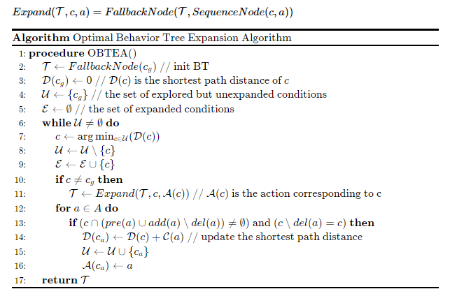

## 代码说明

### 1. `BehaviorTree.py` 实现行为树叶子结点和非叶子结点的定义

- **Leaf **：表示叶节点，可以是动作（`act`）或条件（`cond`）。
- **ControlBT**：代表可能包含控制节点的行为树。它们可以是选择器（`?`）、序列（`>`）、动作节点（`act`）或条件节点（`cond`）。
- 上述两个类都包含 `tick` 方法。

### 2.  `BTExpansionAlgorithm.py` 实现最优行为树扩展算法



使用方法

```
 algo = BTalgorithm(verbose=True)
    algo.clear()
    algo.run_algorithm(start, goal, actions) # 使用算法得到行为树在 algo.bt
    algo.print_solution() # 打印行为树 
    val, obj = algo.bt.tick(state) # 执行行为树
```

### 3. **`tools.py`**  实现打印数据、行为树测试等模块

使用方法

```python
print_action_data_table(goal,start,actions) # 打印所有变量

# 行为树鲁棒性测试，随机生成规划问题
# 设置生成规划问题集的超参数：文字数、解深度、迭代次数
seed=1
literals_num=10
depth = 10
iters= 10
BTTest(seed=seed,literals_num=literals_num,depth=depth,iters=iters)
```

### 4. `Example.py` 中设计规划案例 goals, start,actions

```python
def MoveBtoB ():
    actions=[]
    a = Action(name="Move(b,ab)") 
    a.pre={'Free(ab)','WayClear'}  
    a.add={'At(b,ab)'} 
    a.del_set= {'Free(ab)','At(b,pb)'}         
    a.cost = 1
    actions.append(a)

    a=Action(name="Move(s,ab)") 
    a.pre={'Free(ab)'} 
    a.add={'Free(ab)','WayClear'} 
    a.del_set={'Free(ab)','At(s,ps)'}  
    a.cost = 1
    actions.append(a)

    a=Action(name="Move(s,as)")
    a.pre={'Free(as)'} 
    a.add={'At(s,ps)','WayClear'} 
    a.del_set={'Free(as)','At(s,ps)'} 
    a.cost = 1
    actions.append(a)

    start = {'Free(ab)','Free(as)','At(b,pb)','At(s,ps)'} 
    goal= {'At(b,ab)'} 
    return goal,start,actions
```

### 5. `main.py` 为主函数，实现 规划生成、行为树生成、行为树执行、行为树测试 的整个流程
