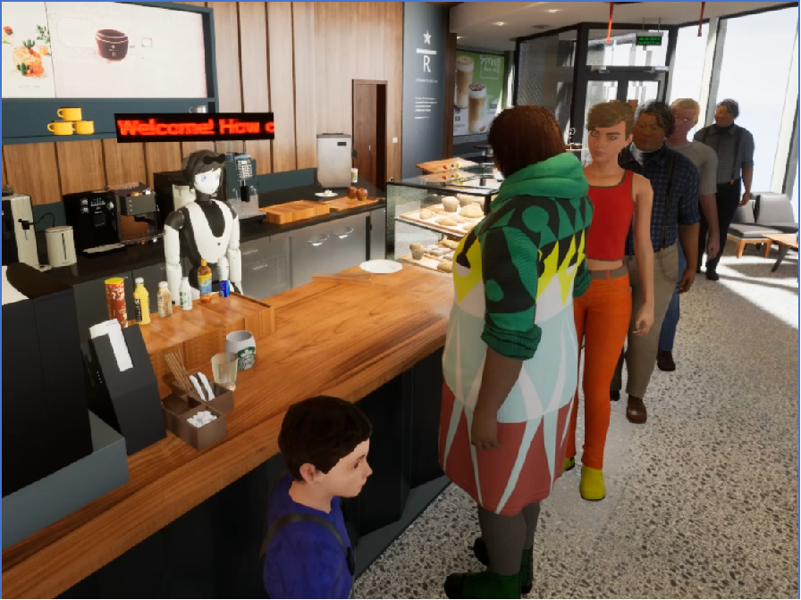

# 🤖 RoboWaiter

> **基于大模型与行为树的生成式具身智能体系统**
> *A Generative Embodied Agent System Powered by LLMs and Behavior Trees*

<div align="center">



[](https://www.python.org/)
[](LICENSE)
[](#)
[](#)

</div>

RoboWaiter 是参加 **达闼杯"机器人大模型与具身智能挑战赛"** 的参赛作品 ——
《基于大模型和行为树的生成式具身智能体》。
项目目标是在模拟咖啡厅场景中，让机器人担任服务员角色，
自主完成 **主动探索、具身对话、视觉导航、视觉操作、复杂开放任务** 等多种具身任务。

我们围绕该系统持续开展研究，并将其拓展为完整的算法体系 ——
覆盖 **单机器人行为树规划 → 多机器人协作 → 启发式 LLM 推理** 的全链路工作。

---

## 📰 News

- **🎉 [2026-06] `MRBTP-demo` 正式上线！**
  MRBTP 的精简教程版本已开源，提供最小可运行示例，便于快速上手多机器人行为树规划。
  🔗 <https://github.com/DIDS-EI/MRBTP-demo>

- **🏆 [2025-02] `MRBTP` (AAAI 2025 Oral, Top 4.6%) 已开源！**
  首个具有 *soundness & completeness* 理论保证的 **多机器人行为树规划算法**，
  通过 *cross-tree expansion* 与 *intention sharing* 实现高效多智能体协作。
  🔗 [Project](https://dids-ei.github.io/Project/MRBTP/) ·
  [Code](https://github.com/DIDS-EI/MRBTP) ·
  [Paper](https://arxiv.org/abs/2502.18072)

- **✨ [2025-01] `OBTEA-demo` 精简版上线！**
  LLM-OBTEA 的轻量教程版本，提供最小化的 BT 生成示例，便于自定义任务复用。
  🔗 <https://github.com/DIDS-EI/OBTEA-demo>

- **📄 [2024-08] `LLM-OBTEA` (IJCAI 2024) 已发表并开源！**
  两阶段框架：大语言模型 *intent understanding* + 最优行为树扩展算法 *OBTEA/HOBTEA*，
  从自然语言指令生成语义正确且任务可达的行为树。
  🔗 [Project](https://dids-ei.github.io/Project/LLM-OBTEA/) ·
  [Code](https://github.com/DIDS-EI/LLM-OBTEA) ·
  [Paper](https://arxiv.org/abs/2405.07474)

- **🎤 [2024-05] RoboWaiter 参赛作品 + 论文工作 被 IJCAI 2024 录用。**

---

## 🌟 Related Projects

我们在 RoboWaiter 基础上持续推进行为树规划研究，形成如下项目矩阵：

| 项目 | 描述 | 会议 | 链接 |
|------|------|:----:|------|
| **🥇 MRBTP** | 多机器人行为树规划与协作，首个 sound & complete 的多机算法 | **AAAI 2025 (Oral)** | [Project](https://dids-ei.github.io/Project/MRBTP/) · [Code](https://github.com/DIDS-EI/MRBTP) · [arXiv](https://arxiv.org/abs/2502.18072) |
| **🎓 MRBTP-demo** | MRBTP 的精简教程版，最小可运行示例 | — | [Code](https://github.com/DIDS-EI/MRBTP-demo) |
| **🥇 LLM-OBTEA** | LLM 意图理解 + 最优行为树扩展，从自然语言指令生成 BT | **IJCAI 2024** | [Project](https://dids-ei.github.io/Project/LLM-OBTEA/) · [Code](https://github.com/DIDS-EI/LLM-OBTEA) · [arXiv](https://arxiv.org/abs/2405.07474) |
| **🎓 OBTEA-demo** | LLM-OBTEA 精简版，最小化的 BT 生成示例 | — | [Code](https://github.com/DIDS-EI/OBTEA-demo) |
| **🥇 HBTP** | 启发式行为树规划，利用 LLM 推理生成有效启发信息 | **ICRA 2025** | [Project](https://dids-ei.github.io/Project/HBTP/) · [arXiv](https://arxiv.org/abs/2406.00085) |
| **🤖 RoboWaiter** | 本项目：咖啡厅场景下的具身智能体系统 | — | [Code](https://github.com/HPCL-EI/RoboWaiter) |

---

## 🧠 1. 技术简介

我们提出 **基于大模型和行为树的生成式具身智能体系统框架**，三大核心组件：

| 组件 | 角色 | 功能 |
|------|------|------|
| 🌳 **行为树 (BT)** | 系统中枢 | 作为大模型与具身智能之间的桥梁，解决两者结合的挑战 |
| 🧠 **大语言模型 (LLM)** | 系统大脑 | 向量数据库 + 工具调用；只输出任务目标而非完整动作序列，缓解具身幻觉 |
| 🦾 **具身机器人** | 系统躯体 | 优化感知与控制接口设计，提高感知高效性与控制准确性 |


---

## 🛠️ 2. 项目安装

### 2.1 环境要求

- **Python ≥ 3.10**

### 2.2 安装步骤

```shell
git clone https://github.com/HPCL-EI/RoboWaiter.git
cd RoboWaiter
pip install -e .
```

以上步骤将完成 RoboWaiter 项目及相关依赖库的安装。

### 2.3 安装 UI 相关依赖

1. **安装 Graphviz** — 用于行为树可视化
   下载 [graphviz-9.0.0](https://gitlab.com/api/v4/projects/4207231/packages/generic/graphviz-releases/9.0.0/windows_10_cmake_Release_graphviz-install-9.0.0-win64.exe)（详见 [官网](https://www.graphviz.org/download/#windows)），
   并将安装目录的 `bin` 文件夹加入系统 `PATH`。
   > 示例：`D:\Program Files (x86)\Graphviz2.38\bin`

2. **安装向量数据库**
   ```shell
   conda install -c conda-forge faiss
   ```

3. **安装 NLP 与翻译工具**（用于相似度计算）
   ```shell
   pip install translate spacy
   python -m spacy download zh_core_web_lg
   ```

   若 `zh_core_web_lg` 下载较慢，可从网盘下载：
   > 链接：<https://pan.baidu.com/s/1vr7dqHsgnh6UChymQc26VA> · 提取码：`1201`
   ```shell
   pip install zh_core_web_lg-3.7.0-py3-none-any.whl
   ```

### 2.4 部署大模型

可采用 **本地部署** 或 **在线 API** 两种方式：

| 方式 | 推荐场景 | 说明 |
|------|----------|------|
| **本地部署** | 离线 / 私有化 | 参赛中使用 [ChatGLM3](https://github.com/THUDM/ChatGLM3)，部署后参考 [官方文档](https://github.com/THUDM/ChatGLM3?tab=readme-ov-file#openai-api--zhipu-api-demo) 开放 OpenAI 兼容 API |
| **在线 API** | 快速试用 | GLM-4 / 文心一言 / GPT-4 等任意支持 OpenAI 协议的服务 |

无论哪种方式，最后均需在 `robowaiter/llm_client/single_round.py` 中修改 API 地址。

---

## 🚀 3. 快速入门

### 3.1 下载并启动仿真器

下载 [CafeSimulator](https://drive.google.com/file/d/1ayAQZbPOyQV2W-V_ZdYv6AoqLOg0zvm1/view?usp=sharing)，解压并运行 `CafeSimulator.exe`。
仿真器启动后显示空场景，等待代码端生成场景并完成机器人交互。

> 国内备用链接：<https://pan.baidu.com/s/1WvyYcnTTsSNNFHGCCvryCw> · 提取码：`1wft`

### 3.2 无 UI 运行

```shell
python tasks_no_ui/<任意场景脚本>.py
```

### 3.3 启动 UI 界面

```shell
python run_ui.py
```

点击左侧按钮可让机器人执行对应任务；
也可在右上方输入目标状态或自然语言对话与机器人交互。


---

## 📂 4. 代码框架

> 📌 `BTExpansionCode/` 为实验数据存档，可忽略。

```
robowaiter/
├── behavior_lib/      # 行为树节点库 (act / cond)
├── behavior_tree/     # 行为树算法：ptml 编译器、最优 BT 逆向扩展等
├── robot/             # 机器人类：BT 加载与执行
├── llm_client/        # 大模型客户端：数据集 / 评测 / 工具调用 / 向量库 / 多轮对话
├── scene/             # 场景基类：与 UE/咖啡厅仿真通信，封装通用接口；ui/ 含界面设计
├── algos/             # 其它算法：MemGPT / navigator / explore / vision / retrieval
├── utils/             # 工具类：行为树绘制等
└── ...

tasks_no_ui/           # 无 UI 场景定义与运行代码
```

### 主要任务一览

| 缩写 | 任务 |
|:----:|------|
| **AEM** | 主动探索和记忆 |
| **GQA** | 具身多轮对话 |
| **VLN** | 视觉语言导航 |
| **VLM** | 视觉语言操作 |
| **OT**  | 复杂开放任务 |
| **AT**  | 自主任务 |
| **CafeDailyOperations** | 整体展示：咖啡厅的一天 |
| **Interact** | 命令行自由交互 |

### 调用大模型对话

```shell
cd robowaiter/llm_client
python multi_rounds.py
```

---

## 🎬 5. 演示花絮

**机器人根据顾客点单，完成订单并送餐：**


**顾客询问物品位置，并要求机器人送回：**


---

## 📚 6. 引用

如果本项目对你的研究有帮助，欢迎引用我们的相关工作：

```bibtex
@inproceedings{chen2024llmobtea,
  title     = {Integrating Intent Understanding and Optimal Behavior Planning for Behavior Tree Generation from Human Instructions},
  author    = {Chen, Xinglin and Cai, Yishuai and Mao, Yunxin and Li, Minglong and Yang, Wenjing and Xu, Weixia and Wang, Ji},
  booktitle = {Proceedings of the 33rd International Joint Conference on Artificial Intelligence (IJCAI)},
  pages     = {6832--6840},
  year      = {2024}
}

@inproceedings{cai2025mrbtp,
  title     = {MRBTP: Efficient Multi-Robot Behavior Tree Planning and Collaboration},
  author    = {Cai, Yishuai and Chen, Xinglin and Cai, Zhongxuan and Mao, Yunxin and Li, Minglong and Yang, Wenjing and Wang, Ji},
  booktitle = {Proceedings of the AAAI Conference on Artificial Intelligence (AAAI)},
  year      = {2025}
}

@inproceedings{cai2025hbtp,
  title     = {HBTP: Heuristic Behavior Tree Planning with Large Language Model Reasoning},
  author    = {Cai, Yishuai and Chen, Xinglin and Mao, Yunxin and Li, Minglong and Yang, Shaowu and Yang, Wenjing and Wang, Ji},
  booktitle = {IEEE International Conference on Robotics and Automation (ICRA)},
  year      = {2025}
}
```

---

## 📜 License

本项目基于 **MIT License** 开源。详见 [LICENSE](LICENSE) 文件。

**Copyright © 2023 NUDT-HPCL-EI. All rights reserved.**

---

<div align="center">

✨ *我们将持续更新和维护，敬请期待！* ✨

</div>
